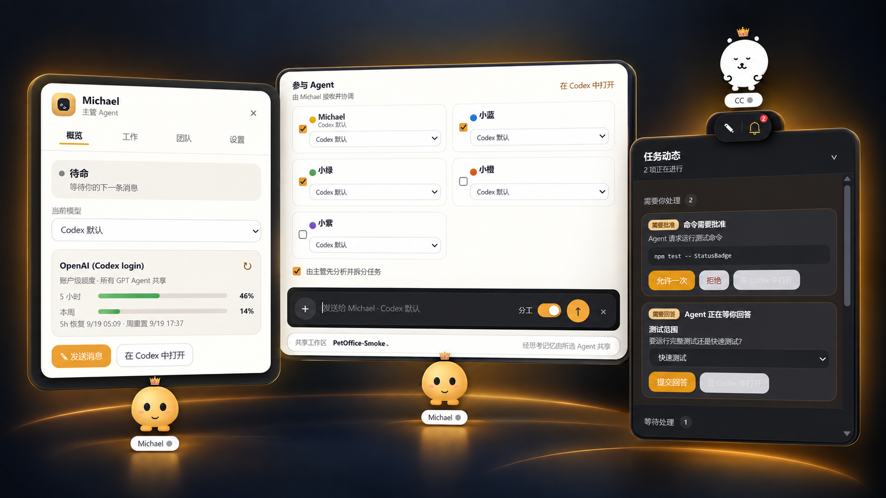
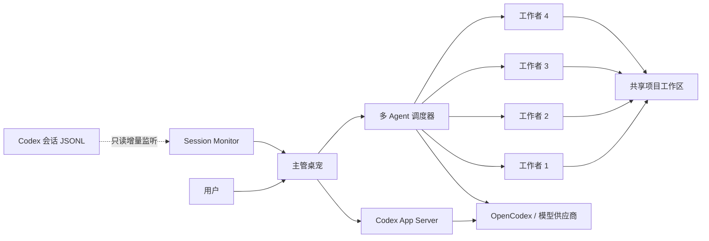

<div align="center">

# Open Pet Office

### 把 AI Agent 团队搬到你的 Windows 桌面

一只主管桌宠常驻桌面，复杂任务到来时再召集最多 4 名工作者。<br>
Codex 实时任务、多模型分工、项目记忆、审批与附件，都集中在一个轻量桌面入口。

[简体中文](README.md) · [English](README_EN.md)

[](https://github.com/Gu-kai-lei/Open-Pet-Office/actions/workflows/ci.yml)


[](LICENSE)

</div>



<p align="center"><sub>主管与额度 · 多 Agent 分工 · 审批和任务动态</sub></p>

> [!IMPORTANT]
> 当前版本是面向 Windows 的早期预览版。它已经能用于真实任务，但接口、数据结构和交互仍可能快速演进。

## 它是什么

Open Pet Office 不是一个单纯的桌宠皮肤，而是 **Codex 与多模型 Agent 的可视化桌面协作层**。

- 平时只有主管桌宠在场，保持桌面安静。
- 普通问题直接进入单 Agent 会话，体验接近 Codex 原生桌宠。
- 打开“分工”后，主管拆解任务并召集工作者并行执行。
- 每只桌宠可以选择不同模型，但所有人共享同一个项目工作区。
- 无论任务从桌宠还是 Codex Desktop 发起，主管都能显示实时状态并跳回原任务。

## 功能全景

| 桌面体验 | Agent 协作 | 项目与安全 |
| --- | --- | --- |
| 🐾 透明置顶桌宠 | 🧠 1 主管 + 最多 4 工作者 | 📁 共享项目工作区 |
| 🖱️ 自由拖动并记住位置 | ⚡ 并行任务执行 | 📝 `HIVE.md` / `MEMORY.md` |
| 💬 原位展开输入框 | 🔀 每只宠物独立选择模型 | 📎 文件拖拽收件箱 |
| 🔔 实时任务卡与任务中心 | 🧩 主管拆解与最终汇总 | ✅ 命令、文件与权限审批 |
| 🎨 Petdex 动画形象 | 🔗 点击直达 Codex 原任务 | 🔒 敏感内容脱敏与沙箱 |
| 📊 模型额度与本地用量 | 🌐 OpenCodex 第三方模型路由 | 💾 最近任务与会话恢复 |

## 从发消息到团队交付

```text
输入任务
   │
   ├─ 分工关闭 ─→ 当前桌宠独立完成 ─→ Codex 会话持续更新
   │
   └─ 分工开启 ─→ 选择项目 / Agent / 模型
                         │
                         ▼
                    主管分析与拆解
                         │
               ┌─────────┼─────────┐
               ▼         ▼         ▼
            工作者 A  工作者 B  工作者 C   …最多 4 名
               └─────────┼─────────┘
                         ▼
                  共享文件、记忆与结果
                         │
                         ▼
                  主管汇总回主任务
```

### 单 Agent：像原生桌宠一样直接

1. 悬停桌宠，点击唯一的输入按钮。
2. 按钮在原位置平滑展开成输入框。
3. 保持“分工”关闭，回车即可发送，无需二次确认。
4. 任务卡持续显示分析、命令、文件、回复或等待处理状态。
5. 点击任务卡，直接打开 Codex Desktop 中对应会话。

### 多 Agent：只在需要时出现

1. 打开输入框右侧的“分工”开关。
2. 选择已有项目，或在下拉菜单顶部新建项目。
3. 选择参与 Agent，并为每个 Agent 指定模型。
4. 主管可先拆解任务，再让工作者并行处理。
5. 所有 Agent 共享项目文件和记忆，最终由主管汇总。

## 桌宠能展示什么

### 实时任务与任务中心

Open Pet Office 只读监听本机 `~/.codex/sessions` 的增量日志，因此不要求任务必须从桌宠发起。

| 来源 | 能看到的内容 |
| --- | --- |
| Codex Desktop / Work Desktop | 根任务、模型、阶段、最近安全进度 |
| Codex 原生快速对话 | 对话任务与最新状态 |
| IDE 扩展 / CLI | 用户会话与执行阶段 |
| Pet Office 单 Agent | 流式回复、审批、提问与结果 |
| Pet Office 分工任务 | 每位工作者的进度与主管汇总 |

多个任务同时运行时，主管卡片显示最近更新任务和“另有 N 项”；铃铛任务中心按“需要处理、进行中、最近完成”统一展示。

### 状态与动画

| 状态 | 桌面反馈 |
| --- | --- |
| 待命 | 轻微呼吸或皮肤待机动画 |
| 分析中 | 任务摘要与推理阶段 |
| 执行命令 | 安全截断后的命令摘要 |
| 修改文件 | 文件阶段与脱敏路径摘要 |
| 等待处理 | 审批或 Agent 提问提醒 |
| 已完成 | 短暂完成徽章与庆祝动画 |
| 已中断 | 灰色停止徽章，不会误显示绿色完成 |
| 连接异常 | 状态未知或连接断开，不永久假装工作中 |

## 文件拖给桌宠

把文件从资源管理器拖到任意桌宠，相当于给该 Agent 添加附件：

- 文件复制到当前项目的 `inbox/`。
- 输入框自动展开并显示附件卡片。
- 发送时将工作区相对路径交给模型。
- 单 Agent 与分工模式都支持。
- 没有当前项目时自动创建按日期命名的上传项目。
- 单次最多 20 个文件，单个不超过 200 MB。

> 模型能否理解图片、PDF 或视频取决于模型本身及其可用工具。

## 项目、记忆与 Agent 通信

```text
<project>/
├─ HIVE.md       # 团队共享约定
├─ MEMORY.md     # 项目长期记忆
├─ inbox/        # 拖入的附件
├─ tasks/        # 任务简报、计划与结果
└─ messages/     # Agent 间消息（预留）
```

- 同一个项目中的 Agent 读取同一工作区。
- 每个模型仍可拥有自己的会话，但项目文件与记忆是团队共享的。
- 最近 100 条任务会保存在本地，可恢复已知会话或打开历史结果。
- 桥接协议允许 Codex 主线程通过 `bridge/` 派单并读取汇总。

## 多模型与额度

Open Pet Office 读取 OpenCodex 模型目录，让每只桌宠都能独立切换模型。

- GPT / Codex 登录模型：显示账户共享的 5 小时与每周剩余比例。
- DeepSeek 等 API 模型：供应商提供余额接口时显示余额，否则显示本地累计用量。
- 每只桌宠可设置 token 用量上限。
- OpenCodex 代理不可用时，会明确显示模型或额度不可用，不伪造余额。

> [!NOTE]
> 外接模型的能力、价格和上下文限制由对应供应商决定。Open Pet Office 只负责路由、展示与任务协作。

## 桌面交互

| 操作 | 行为 |
| --- | --- |
| 悬停桌宠 | 显示输入与任务动态快捷入口 |
| 左键桌宠 | 打开分页详情：概览、工作、团队、形象、设置 |
| 右键桌宠 | 召唤/隐藏成员、切换项目或退出 |
| 点击实时任务卡 | 打开对应 Codex 任务 |
| 点击桌面空白 / `Esc` | 收起当前菜单或面板 |
| 隐藏主管 | 最小化到系统托盘，后台任务继续 |
| 退出 Pet Office | 真正结束进程 |

还支持迷你模式、80%–140% 缩放、减少动画、开机自启，以及全局显示/隐藏快捷键。

## Petdex 形象与动画

Open Pet Office 兼容 Petdex 标准 8×9 / 8×11 spritesheet，并会自动检测每一行实际存在的动画帧，避免播放空帧或错位。

```powershell
npx petdex install boba
```

安装后在“形象”页刷新即可选择。项目不捆绑第三方皮肤；下载和公开分发前请确认皮肤作者及底层 IP 的许可。

## 架构



| 模块 | 作用 |
| --- | --- |
| Electron 主进程 | 透明窗口、托盘、快捷键、IPC 与任务注册表 |
| Renderer | 桌宠、输入框、任务中心、项目与模型 UI |
| App Server Client | 单 Agent 对话、流式事件、审批与提问 |
| Session Monitor | 只读聚合 Codex Desktop 的 JSONL 会话日志 |
| Dispatcher | 多 Agent 并行任务与进度映射 |
| Inbox | 安全复制拖入文件并生成共享相对路径 |

## 安装与运行

### 前置条件

- Windows 10/11
- Node.js 18+
- Codex CLI 0.155 或更高版本
- 可选：[OpenCodex](https://github.com/lidge-jun/opencodex)，用于接入 DeepSeek 等第三方模型

### 从源码运行

```powershell
git clone https://github.com/Gu-kai-lei/Open-Pet-Office.git
cd Open-Pet-Office
npm install
npm start
```

### 测试与构建

```powershell
npm test
npm run dist
```

便携版输出到 `dist/Pet-Office-0.10.0-portable.exe`。打包版运行后，设置中的开机自启才会生效。

## 隐私与安全边界

- 会话监控严格只读，不修改、移动或归档 Codex 日志。
- API Key、Authorization、token、密码等内容在桌面显示前会被遮蔽。
- 不显示完整系统提示词或完整工具输出。
- 单 Agent 使用 `workspace-write + on-request`。
- 多 Agent 工作者使用 `workspace-write` 沙箱，不能自行提权。
- API Key 不写入仓库；OpenCodex 管理令牌仅从本机读取。
- 删除等敏感操作继续遵循 Codex 的审批准则。

发现安全问题请阅读 [SECURITY.md](SECURITY.md)，不要在公开 Issue 中粘贴密钥或私人日志。

## 开发与贡献

```powershell
npm install
npm test
npm start
```

测试覆盖：会话聚合、半行与轮换、状态生命周期、脱敏、铃铛竞态、文件收件箱、会话恢复和 App Server 进度映射。提交改动前请阅读 [CONTRIBUTING.md](CONTRIBUTING.md)。

## 当前限制

- 当前优先支持 Windows，尚未适配 macOS 和 Linux。
- 单 Agent 已使用 Codex App Server；多 Agent 分工仍通过 Codex CLI 并行执行。
- Session Monitor 依赖 Codex 本地 JSONL 格式，Codex 升级后可能需要同步适配。
- Codex 暂无公开稳定接口让第三方应用直接创建桌面端侧栏项目；项目目录仍是权威工作区。
- `codex://threads/<id>` 会话级深链属于实验性能力。
- Petdex 皮肤需要在本机安装，暂不支持应用内下载。

## 路线图

- [ ] 统一单 Agent 与多 Agent 的 App Server 任务模型
- [ ] 项目级共享记忆检索与可视化
- [ ] 更完整的 Agent 间消息、依赖与讨论视图
- [ ] 更多供应商配额适配器与预算策略
- [ ] 安装包、自动更新与签名发布
- [ ] 可选的跨平台支持

## 致谢与商标说明

项目受 Codex 桌宠、Munder Difflin 和多 Agent 编排工具的交互启发，并使用 OpenCodex 作为可选模型接入层、Petdex 作为可选形象生态。

Open Pet Office 是社区项目，与 OpenAI、Petdex、模型供应商及第三方皮肤作者无官方隶属关系。Codex、DeepSeek 及其他名称分别属于其权利人。

## License

[MIT](LICENSE)
