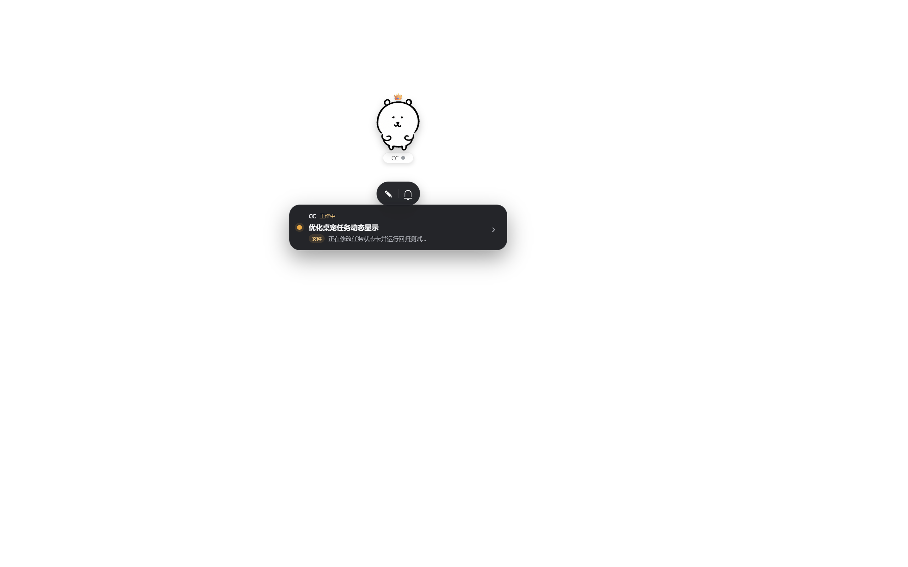
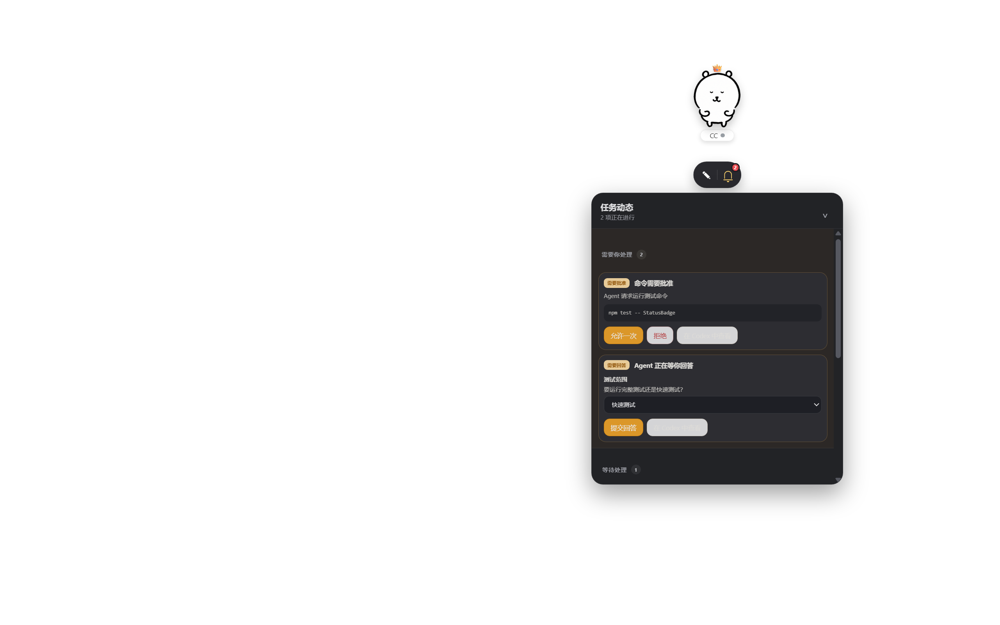
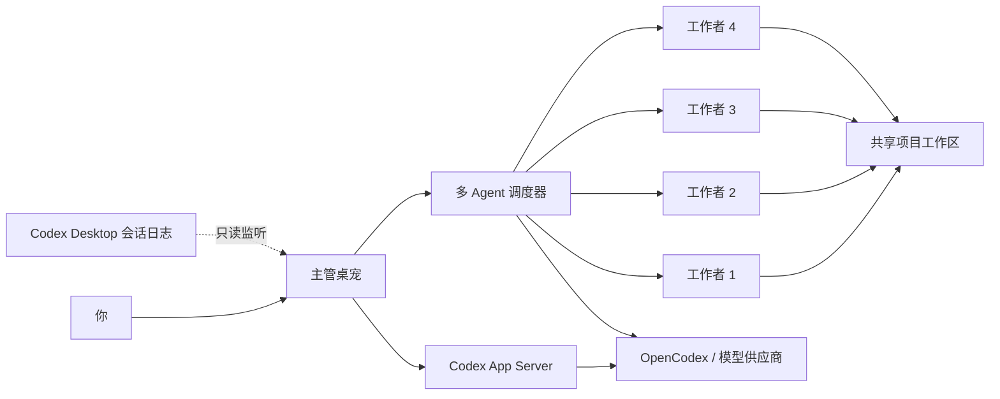

<div align="center">

# Open Pet Office

### 把你的 AI Agent 团队放到 Windows 桌面上

一只主管桌宠常驻桌面，需要协作时再召集工作者。<br>
实时同步 Codex 任务，支持多模型分工、共享项目工作区、审批提醒与文件拖拽。

[](https://github.com/Gu-kai-lei/Open-Pet-Office/actions/workflows/ci.yml)


[](LICENSE)

> 当前为早期预览版，适合愿意边用边完善的开发者。

</div>

<p align="center">
  
  
</p>

## 为什么做它

Codex、DeepSeek 和其他模型可以各自完成任务，但并行工作时往往缺少一个统一、直观的入口。Open Pet Office 把它们变成桌面上的可见团队：主管负责接收任务和调度，工作者共享项目文件，并把状态、审批与结果持续反馈到同一块桌面界面。

## 核心能力

| 能力 | 说明 |
| --- | --- |
| 🐾 桌面 Agent | 透明置顶、自由拖动、状态动画、系统托盘与快捷键 |
| 🔔 实时任务 | 只读监听 Codex 会话日志，无需先从桌宠发起任务即可显示进度 |
| 🧠 多 Agent 分工 | 1 名主管 + 最多 4 名工作者，共享同一个项目工作区 |
| 🔀 多模型路由 | 读取 OpenCodex 模型目录，可为每只桌宠独立选择模型 |
| 📎 拖拽文件 | 将资源管理器文件拖给桌宠，自动复制到项目 `inbox/` 并附加到任务 |
| ✅ 审批与问答 | 命令、文件修改、权限申请和 Agent 提问集中显示并可处理 |
| 🎨 可换形象 | 兼容 Petdex 标准 spritesheet，自动识别可用动画帧 |
| 📊 用量视图 | GPT 显示账户级 5 小时/每周额度；外接 API 在供应商支持时显示余额 |

## 30 秒开始

### 前置条件

- Windows 10/11
- Node.js 18+
- Codex CLI 0.155 或更高版本
- 可选：[OpenCodex](https://github.com/lidge-jun/opencodex)，用于接入 DeepSeek 等第三方模型

### 本地运行

```powershell
git clone https://github.com/Gu-kai-lei/Open-Pet-Office.git
cd Open-Pet-Office
npm install
npm start
```

首次启动后，主管桌宠会出现在桌面右下区域。悬停桌宠即可打开输入框或任务动态。

### 构建 Windows 便携版

```powershell
npm test
npm run dist
```

产物位于 `dist/Pet-Office-0.10.0-portable.exe`。

## 常用操作

### 单 Agent 对话

1. 悬停主管桌宠，点击输入图标。
2. 保持“分工”关闭，输入任务并发送。
3. 桌宠显示当前阶段；点击任务卡可回到对应 Codex 任务。

### 多 Agent 协作

1. 打开输入框并开启“分工”。
2. 选择或新建项目，再选择参与者与各自模型。
3. 主管拆解任务，工作者并行执行，结果最终汇总回主任务。

### 拖入附件

把文件从资源管理器直接拖到任意桌宠。文件会复制到当前项目的 `inbox/`，自动出现在输入框中；没有项目时会创建一个按日期命名的上传项目。

## 工作原理



项目工作区约定：

```text
<project>/
├─ HIVE.md       # 团队共享约定
├─ MEMORY.md     # 项目长期记忆
├─ inbox/        # 拖入的附件
├─ tasks/        # 任务简报、计划与结果
└─ messages/     # Agent 间消息（预留）
```

## 隐私与安全

- Codex Desktop 任务监控仅只读解析本机 `~/.codex/sessions`，不会修改、移动或归档会话文件。
- 命令、路径和回复在桌面卡片显示前会截断并脱敏 API Key、Authorization、token、密码等内容。
- 单 Agent 使用 `workspace-write + on-request`；多 Agent 工作者使用 `workspace-write` 沙箱。
- API Key 不写入项目仓库；OpenCodex 管理令牌仅从本机配置读取。
- 拖入文件会复制到项目目录，单次最多 20 个、单个不超过 200 MB。

发现安全问题请参阅 [SECURITY.md](SECURITY.md)，不要在公开 Issue 中粘贴密钥或私人日志。

## Petdex 形象

前往 [petdex.dev](https://petdex.dev/) 选择形象，并按网站说明安装，例如：

```powershell
npx petdex install boba
```

安装后在桌宠左键菜单的“形象”页刷新即可。Open Pet Office 不捆绑第三方皮肤；公开分发皮肤前请确认作者和底层 IP 的许可。

## 开发

```powershell
npm install
npm test
npm start
```

测试覆盖会话日志聚合、增量读取、脱敏、任务生命周期、铃铛状态机、附件收件箱、会话恢复和 App Server 进度映射。贡献前请阅读 [CONTRIBUTING.md](CONTRIBUTING.md)。

## 当前限制

- 当前以 Windows 10/11 为主，尚未针对 macOS 和 Linux 适配。
- 多 Agent 分工仍通过 Codex CLI 并行执行；单 Agent 已使用 Codex App Server。
- Codex 会话监听依赖本地 JSONL 日志格式，Codex 升级后可能需要同步适配。
- Codex 暂无公开稳定接口让第三方应用直接创建桌面端侧栏项目；项目目录仍是权威工作区。
- 外接模型余额取决于供应商是否提供配额接口，无法读取时仅显示本地累计用量。
- `codex://threads/<id>` 会话深链仍属于实验性能力。

## 路线图

- [ ] 统一单 Agent 与多 Agent 的 App Server 任务模型
- [ ] 项目级共享记忆检索与可视化
- [ ] 更完整的 Agent 间消息与任务依赖视图
- [ ] 供应商配额适配器与预算策略
- [ ] 安装包、自动更新与签名发布
- [ ] 可选的跨平台支持

## 致谢与说明

本项目受 Codex 桌宠、Munder Difflin 和多 Agent 编排工具的交互启发，并使用 OpenCodex 作为可选模型接入层、Petdex 作为可选形象生态。

Open Pet Office 是社区项目，与 OpenAI、Petdex、各模型供应商及第三方皮肤作者无官方隶属关系。Codex、DeepSeek 及其他名称分别属于其权利人。

## License

[MIT](LICENSE)
