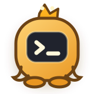
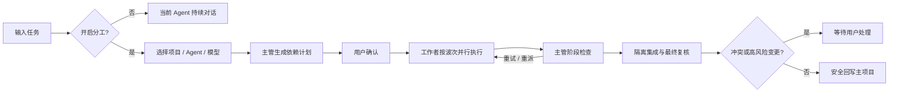

<div align="center">
  

# Open Pet Office

### 把你的 AI Agent 团队，搬到 Windows 桌面

一只主管桌宠接收任务，需要时召集最多 4 名工作者。<br>
实时同步 Codex 任务，用不同模型并行协作，在隔离工作区完成、检查并安全交付。

[简体中文](README.md) · [English](README_EN.md)

[](https://github.com/Gu-kai-lei/Open-Pet-Office/releases/latest)
[](https://github.com/Gu-kai-lei/Open-Pet-Office/releases)
[](https://github.com/Gu-kai-lei/Open-Pet-Office/actions/workflows/ci.yml)
[](#下载与快速开始)
[](LICENSE)

**[下载 Windows 便携版](https://github.com/Gu-kai-lei/Open-Pet-Office/releases/latest)** · [5 分钟快速上手](docs/GETTING_STARTED.md) · [提交问题](https://github.com/Gu-kai-lei/Open-Pet-Office/issues/new/choose)
</div>


> [!IMPORTANT]
> Open Pet Office 目前是 Windows 早期预览版。它已可处理真实项目，但界面、协议和数据结构仍会继续演进。

## 为什么是 Open Pet Office？

<table>
  <tr>
    <td width="33%" valign="top">
      <h3>🐾 看得见的协作</h3>
      <p>主管常驻桌面，工作者只在任务需要时出现。思考、执行、等待、失败和完成都有清晰状态。</p>
    </td>
    <td width="33%" valign="top">
      <h3>🧠 真正的主管闭环</h3>
      <p>主管先规划依赖，再分波次派工、检查、重试或重派，最后复核结果。它不是把几段回复简单拼起来。</p>
    </td>
    <td width="33%" valign="top">
      <h3>🔒 项目安全优先</h3>
      <p>每位工作者在独立 worktree 或快照中执行。冲突、删除和计划外写入会暂停，不会静默覆盖你的文件。</p>
    </td>
  </tr>
</table>

## 下载与快速开始

1. 从 [Releases](https://github.com/Gu-kai-lei/Open-Pet-Office/releases/latest) 下载 `Pet-Office-*-portable.exe`。
2. 确认本机已安装并登录 Codex CLI 0.155 或更高版本。
3. 运行应用，将鼠标移到主管桌宠上，点击输入图标。
4. 普通任务直接发送；复杂任务开启“分工”，选择项目、Agent 与模型。

当前公开构建未配置 Windows 签名证书，SmartScreen 可能显示“未知发布者”。Release 页面提供 SHA-256，可用于核对下载文件。

需要第三方模型？安装可选的 [OpenCodex](https://github.com/lidge-jun/opencodex)，即可把 DeepSeek、GLM 等模型路由到 Codex。详细步骤见 [快速上手](docs/GETTING_STARTED.md)。

## 📦 最近更新

**v0.14.12 · 2026-09-24**

- 📝 Mission 完成后主管会话以中文可读总结收尾，任务卡将最终复核渲染为结论徽章、验证情况与风险清单，不再显示原始 JSON
- 📖 OpenCodex 会话完成后可在 Codex 桌面端正常打开：provider 定义以带标记的托管块写入 config.toml，已损坏的历史会话一并修复
- 🔗 Mission 任务编号与依赖引用统一解析，兼容主管返回的 `T1` / `t1` 混合大小写，阶段审核结果也能准确匹配任务
- ✅ 修复分工规划的严格 JSON Schema、主管续接权限和工作者报告兼容，真实双 Agent 链路已跑通规划、执行、复核与安全回写
- 🔒 Mission 运行期间在 Pet Office 内查看主管记录，结束后才开放 Codex 对话，避免 active writer 冲突
- 🔌 OpenCodex 关闭 Responses WebSocket 时自动使用兼容的 HTTP/SSE 传输，避免 `426 Upgrade Required`
- 🛠️ “需要处理”任务可在等待列表直接重新规划；续接主管任务保留项目目录并自动弹出确认窗口
- 🧩 兼容路由模型返回的 Mission 字段别名，复杂计划不会再丢失任务说明和执行模式
- 🧭 修复 Mission 多行提示词被截断；主管 Codex 任务现在收到完整目标，失败计划可直接重新规划
- 🖱️ 连续拖放多个链接给桌宠时，输入框保持打开并依次追加链接；点击其他窗口不再误关输入框
- 🔄 归档会话自动迁移到新会话；429 限流退避不再密集重试
- 🪟 全新浮动工作台，侧栏清晰区分项目、团队与设置
- ✎ 对话、分工、截图一步直达，项目与附件集中在输入卡片
- ◉ 任务中心支持状态筛选与直接取消，待处理事项优先显示
- 🎨 统一暖色与深色视觉，设置按用途分组，适配窄窗口

完整迭代计划与历史版本见 🗺️ [路线图](docs/ROADMAP.md)。

## 🚀 从一句话到团队交付



关闭分工时，桌宠就是一个轻量的 Codex 会话入口；开启分工后，同一个输入框升级为可恢复的 Mission 工作流。

## 🧰 你可以做什么

| 能力 | 使用体验 |
| --- | --- |
| 🐾 **Codex 实时任务** | 只读监听本机 Codex 会话；即使任务从 Codex Desktop 发起，主管也会自动显示任务卡 |
| 🧠 **1 + 4 Agent 团队** | 一名主管加最多四名工作者，每只桌宠可独立选择模型 |
| 🗂️ **持久化 Mission** | 依赖图、执行波次、结构化报告、主管复核、失败重派和重启恢复 |
| 🌳 **隔离工作区** | 干净 Git 使用 worktree；脏 Git 和非 Git 项目使用快照副本 |
| 📁 **项目与会话** | 新建、继续、重置上下文；项目重命名、归档、恢复、筛选和附件清理 |
| ✅ **审批与提问** | 在铃铛任务中心处理命令批准、用户问题和冲突，不必寻找原始窗口 |
| 📎 **文件与链接拖放** | 把文件复制到项目 `inbox/`；Canvas / 浏览器 HTTP(S) 链接作为安全参考卡附加 |
| 📸 **截图提问** | `Ctrl + Alt + S`、右键“截图提问”或输入 `/截图`；选区后预览并确认发送 |
| 📊 **模型与额度** | 读取 Codex 账户 5 小时 / 每周额度；第三方供应商支持时显示余额 |
| 🎨 **Petdex 形象** | 内置多套动画形象，也可以跳转 Petdex 发现更多桌宠 |
| 🖥️ **桌面可靠性** | 多显示器、全屏避让、托盘、全局快捷键、通知分级和减少动画 |

## 🔔 实时状态，不打断工作

主管桌宠下方的任务卡会显示当前模型、任务摘要、执行阶段和最新安全进度。多个任务同时运行时，卡片显示最近更新的一项和额外任务数量；点击即可回到对应 Codex 任务。

铃铛任务中心统一展示：

- **需要处理**：审批、回答、冲突和恢复确认
- **进行中**：Codex Desktop、单 Agent 对话和多 Agent Mission
- **最近完成**：完成、中断、失败和取消的准确结果

任务动态只展示脱敏、截断后的摘要，不会把完整命令输出、系统提示词或密钥放到桌面上。

## 🌐 多模型协作

Open Pet Office 以 Codex 为会话和执行入口，通过 OpenCodex 接入其他兼容模型。每只桌宠都可以独立切换模型；主管规划时会参考模型的代码、视觉、长上下文、速度与成本标签，并给出参与者建议，最终选择仍由你确认。

| 模型来源 | 接入方式 | 额度显示 |
| --- | --- | --- |
| OpenAI / Codex | Codex 登录 | 账户级 5 小时与每周剩余比例 |
| DeepSeek、GLM 等 | OpenCodex Provider | 供应商提供接口时显示余额，否则明确标记不可用 |
| 其他 Codex 可见模型 | OpenCodex 自定义配置 | 自动进入模型目录，可为每个 Agent 单独选择 |

## 🔒 Mission 如何保护项目

Mission 将计划和审查记录保存在项目的 `.pet-office/` 中，把运行时副本和完整日志放在 `~/.pet-office/runtime/`。工作者只能修改自己的隔离环境；已接受的成果先进入集成区，主管终审后才准备回写。

以下情况会暂停并等待用户：

- 主项目在 Mission 期间发生变化
- 多名工作者修改同一个文件并产生冲突
- 删除文件、修改计划外路径或出现批量二进制变更
- 节点连续失败、依赖无法满足或应用异常退出

更多实现细节见 [架构说明](docs/ARCHITECTURE.md)。

## 📚 项目文档

| 文档 | 内容 |
| --- | --- |
| [快速上手](docs/GETTING_STARTED.md) | 安装、第一次对话、Mission、文件拖放和常见问题 |
| [架构说明](docs/ARCHITECTURE.md) | 模块、Mission 生命周期、隔离策略、本地数据与安全边界 |
| [路线图](docs/ROADMAP.md) | 已完成版本和下一阶段方向 |
| [更新日志](CHANGELOG.md) | 各版本新增与修复 |
| [贡献指南](CONTRIBUTING.md) | 本地开发、测试要求和 PR 规范 |
| [安全策略](SECURITY.md) | 私密报告安全问题的渠道 |

## 🛠️ 从源码运行

```powershell
git clone https://github.com/Gu-kai-lei/Open-Pet-Office.git
cd Open-Pet-Office
npm install
npm test
npm start
```

构建 Windows portable：

```powershell
npm run dist
```

测试覆盖会话聚合、日志半行与轮换、状态生命周期、敏感内容脱敏、铃铛竞态、文件收件箱、会话恢复、Mission 依赖与隔离，以及 v0.12 / v0.13 的产品契约。

## 🛡️ 隐私与安全

- 会话监控严格只读，不修改、移动或归档 Codex 日志。
- API Key、Authorization、token、密码等内容在桌面和崩溃记录中自动遮蔽。
- 单 Agent 继续遵循 Codex 的沙箱和审批准则。
- 多 Agent 工作者只能写各自的隔离环境。
- 崩溃报告只保存在本机，不自动上传遥测。
- 拖入文件采用复制，不移动或删除源文件。

发现安全问题请通过 [GitHub Security Advisory](https://github.com/Gu-kai-lei/Open-Pet-Office/security/advisories/new) 私密报告。

<details>
<summary><strong>当前限制</strong></summary>

- 当前优先支持 Windows 10/11，尚未适配 macOS 和 Linux。
- 单 Agent 使用 Codex App Server；多 Agent 工作者目前仍由 Codex CLI 并行执行。
- Session Monitor 依赖 Codex 本地 JSONL 格式，Codex 升级后可能需要同步适配。
- `codex://threads/<id>` 会话深链属于实验性能力。
- Petdex 形象暂不支持在应用内直接下载。
- 当前公开 portable 未配置 Windows 代码签名证书。

</details>

## 🤝 参与项目

Bug、交互问题和新场景都欢迎反馈。提交前请阅读 [CONTRIBUTING.md](CONTRIBUTING.md)，并确保截图和日志中不含 API Key、访问令牌或私人会话内容。

- [报告 Bug](https://github.com/Gu-kai-lei/Open-Pet-Office/issues/new?template=bug_report.yml)
- [提出功能建议](https://github.com/Gu-kai-lei/Open-Pet-Office/issues/new?template=feature_request.yml)
- [查看路线图](docs/ROADMAP.md)

## 致谢与商标说明

项目受 Codex 桌宠、Munder Difflin 和多 Agent 编排工具的交互启发，并使用 OpenCodex 作为可选模型接入层、Petdex 作为可选形象生态。

Open Pet Office 是社区项目，与 OpenAI、Petdex、模型供应商及第三方皮肤作者无官方隶属关系。Codex、DeepSeek 及其他名称分别属于其权利人。

## License

[MIT](LICENSE) © Gu-kai-lei
