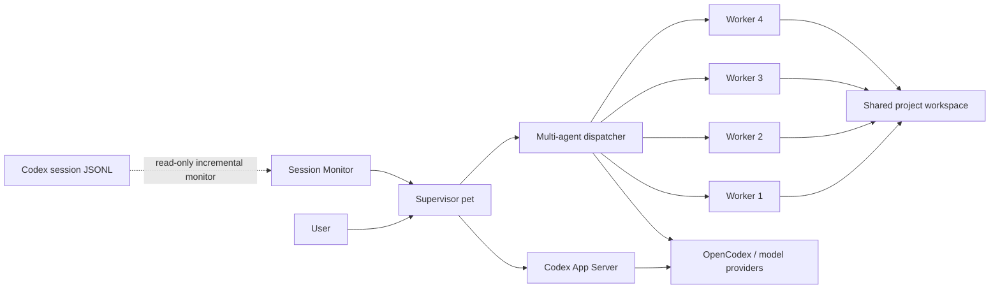

<div align="center">

# Open Pet Office

### Bring an AI agent team to your Windows desktop

Keep one supervisor pet on your desktop and summon up to four workers only when a task needs a team.<br>
Live Codex tasks, multi-model delegation, project memory, approvals, and attachments in one lightweight desktop surface.

[简体中文](README.md) · [English](README_EN.md)

[](https://github.com/Gu-kai-lei/Open-Pet-Office/actions/workflows/ci.yml)


[](LICENSE)

</div>


<p align="center"><sub>Supervisor and quota · Multi-agent delegation · Approvals and live activity</sub></p>

> [!IMPORTANT]
> This is an early Windows preview. It can already handle real work, but APIs, data formats, and interactions may still evolve quickly.

### v0.13.0: desktop experience and release reliability

- Follow the cursor, stay on the primary display, or target a specific monitor, with safe viewport clamping after display changes.
- Avoid fullscreen apps by moving the supervisor to a corner, hiding the overlay, or leaving it unchanged.
- Choose quiet, standard, or detailed notifications without stopping live task state updates.
- Use rebuilt attachment cards, font sizing and font choices, keyboard navigation, visible focus, and screen-reader announcements.
- Keep redacted crash reports local and check GitHub Releases for updates from the settings page.
- Portable builds use real Windows signing when `CSC_LINK` / `CSC_KEY_PASSWORD` are provided and report the detected signature status.

### v0.12.0: project and session workspace

- Create, continue, and reset agent context from a project session list.
- Rename, archive, restore, or unregister projects without deleting source folders.
- Filter the task center by project and pin any live task or Mission card.
- See code, vision, long-context, speed, and cost capability labels for routed models.
- Let Pet Office recommend participants while keeping Agent, model, and plan confirmation under user control.

### v0.11.0: a real supervisor agent

- Delegation is now a persistent Mission with a dependency plan that requires confirmation before execution.
- Workers run in dependency waves, followed by supervisor acceptance, retry, reassignment, or failure decisions.
- Clean Git projects use isolated worktrees; dirty Git and non-Git projects use isolated snapshots.
- Structured reports and change manifests replace raw response concatenation.
- Conflicts, project drift, deletions, and out-of-scope changes pause before write-back.
- Mission dependencies, retries, recovery, and final review appear in the activity center.

## What it is

Open Pet Office is not just a desktop-pet skin. It is a **visual desktop collaboration layer for Codex and multi-model agents**.

- A single supervisor stays visible during normal use.
- Simple prompts go directly to one agent, much like the native Codex pet experience.
- Delegation mode lets the supervisor split work and summon parallel workers.
- Every pet may use a different model while sharing the same project workspace.
- Tasks started from either Pet Office or Codex Desktop appear as live cards that jump back to the original thread.

## Feature map

| Desktop experience | Agent collaboration | Projects and safety |
| --- | --- | --- |
| 🐾 Transparent always-on-top pets | 🧠 1 supervisor + up to 4 workers | 📁 Shared project workspace |
| 🖱️ Dragging with saved positions | ⚡ Dependency-wave execution | 📝 Missions / project memory |
| 💬 Inline expanding composer | 🔀 Per-pet model selection | 📎 Drag-and-drop inbox |
| 🔔 Live task cards and activity center | 🧩 Supervisor planning and synthesis | ✅ Command, file, and permission approvals |
| 🎨 Petdex animated appearances | 🔗 One-click return to Codex | 🔒 Redaction and sandboxing |
| 📊 Quota and local usage views | 🌐 OpenCodex model routing | 💾 History and conversation recovery |

## From prompt to team delivery

```text
Prompt
  │
  ├─ Delegation off ─→ Selected pet works alone ─→ Live Codex thread
  │
  └─ Delegation on ─→ Choose project / agents / models
                               │
                               ▼
                     Supervisor plans the work
                               │
                    ┌──────────┼──────────┐
                    ▼          ▼          ▼
                 Worker A   Worker B   Worker C   …up to 4
                    └──────────┼──────────┘
                               ▼
                    Shared files, memory, results
                               │
                               ▼
                    Supervisor returns a synthesis
```

### Single-agent mode: direct by default

1. Hover over a pet and click its single input button.
2. The button smoothly expands into the composer in place.
3. Leave Delegation off and press Enter—there is no extra confirmation.
4. A live card reports analysis, commands, files, replies, or pending input.
5. Click the card to open the matching Codex Desktop task.

### Multi-agent mode: a team only when you need one

1. Turn on Delegation from the right side of the composer.
2. Select an existing project or create one from the project picker.
3. Choose participating agents and a model for each agent.
4. The supervisor creates a wave-based dependency plan for confirmation.
5. Every wave is reviewed; a failed node may be retried or reassigned once.
6. Accepted changes are integrated and reviewed in isolation before safe write-back.

## Live tasks and the activity center

Open Pet Office incrementally and read-only monitors local `~/.codex/sessions` logs. A task does not have to originate in Pet Office to appear on the desktop.

| Source | What is surfaced |
| --- | --- |
| Codex Desktop / Work Desktop | Root task, model, stage, latest safe progress |
| Native Codex quick chat | Conversation task and current state |
| IDE extension / CLI | User sessions and execution stages |
| Pet Office single agent | Streaming replies, approvals, questions, results |
| Pet Office delegation | Worker progress and supervisor synthesis |

When several tasks are active, the supervisor card shows the most recently updated one plus an “N more” count. The bell opens one activity center grouped into Needs attention, In progress, and Recent.

### Status feedback

| State | Desktop feedback |
| --- | --- |
| Idle | Gentle idle or skin-specific animation |
| Analyzing | Task summary and reasoning stage |
| Running command | Safely truncated command summary |
| Editing files | File stage and redacted path summary |
| Needs attention | Approval or agent-question alert |
| Completed | Short-lived completion badge and celebration |
| Aborted | Gray stop badge—never a false green success |
| Disconnected | Unknown/disconnected state instead of permanent “working” |

## Drop files onto an agent

Drag files from File Explorer directly onto any pet:

- Files are copied into the current project's `inbox/`.
- The composer opens and shows attachment chips.
- Workspace-relative paths are included with the prompt.
- Both single-agent and delegation modes support attachments.
- If no project exists, an upload project is created for the current date.
- Up to 20 files per drop and 200 MB per file.

Whether a model can understand images, PDFs, or video depends on that model and its available tools.

## Projects, memory, and communication

```text
<project>/
├─ inbox/        # Dropped attachments
└─ .pet-office/
   ├─ MEMORY.md  # Shared project memory
   └─ missions/  # Plans, events, messages, reviews, and artifacts
```

- Each worker uses an isolated worktree or snapshot to avoid concurrent overwrites.
- Each model can keep its own conversation while project files and memory remain shared.
- Interrupted Missions are recoverable after restart without blindly repeating accepted work.
- The `bridge/` protocol lets a Codex main thread dispatch work and collect summaries.

## Models and quota

Open Pet Office reads the OpenCodex model catalog and allows independent model selection per pet.

- GPT/Codex login models show account-level five-hour and weekly remaining percentages.
- API models such as DeepSeek show provider balance when an endpoint exists, otherwise local accumulated usage.
- Each pet can have a token budget cap.
- If OpenCodex is unavailable, the UI reports the model or quota as unavailable instead of inventing a value.

> [!NOTE]
> Capabilities, pricing, and context limits belong to each provider. Open Pet Office handles routing, display, and collaboration.

## Desktop interactions

| Action | Result |
| --- | --- |
| Hover a pet | Reveal composer and activity shortcuts |
| Left-click | Open paged details: Overview, Work, Team, Appearance, Settings |
| Right-click | Summon/hide workers, switch project, or exit |
| Click a live task card | Open the matching Codex task |
| Click empty desktop / press `Esc` | Dismiss the active menu or panel |
| Hide the supervisor | Minimize to tray while background work continues |
| Exit Pet Office | Actually terminate the process |

Mini mode, 80%–140% scaling, reduced motion, startup launch, and global show/hide shortcuts are also supported.

## Petdex appearances and animation

Open Pet Office supports standard Petdex 8×9 and 8×11 spritesheets. It detects non-empty frames per animation row to avoid blank or misaligned playback.

```powershell
npx petdex install boba
```

Refresh the Appearance page after installation. The project does not bundle third-party skins; verify the skin author's and underlying IP owner's permissions before redistribution.

## Architecture



| Module | Responsibility |
| --- | --- |
| Electron main process | Transparent window, tray, shortcuts, IPC, task registry |
| Renderer | Pets, composer, activity center, project and model UI |
| App Server client | Single-agent threads, streaming events, approvals, questions |
| Session Monitor | Read-only aggregation of Codex Desktop JSONL sessions |
| Dispatcher | Parallel workers and progress mapping |
| Inbox | Safe attachment copying and shared relative paths |

## Install and run

### Requirements

- Windows 10/11
- Node.js 18+
- Codex CLI 0.155 or newer
- Optional: [OpenCodex](https://github.com/lidge-jun/opencodex) for providers such as DeepSeek

### Run from source

```powershell
git clone https://github.com/Gu-kai-lei/Open-Pet-Office.git
cd Open-Pet-Office
npm install
npm start
```

### Test and build

```powershell
npm test
npm run dist
```

The portable build is written to `dist/Pet-Office-0.13.0-portable.exe`. Startup launch is effective for packaged builds. An unsigned build remains supported, but Settings clearly reports that no valid signature was detected.

## Privacy and security boundaries

- Session monitoring is strictly read-only and never moves, archives, or edits Codex logs.
- API keys, authorization headers, tokens, and passwords are masked before desktop display.
- Full system prompts and full tool output are never shown on task cards.
- Single-agent sessions use `workspace-write + on-request`.
- Multi-agent workers use the `workspace-write` sandbox and cannot elevate themselves.
- API keys are not stored in the repository; the OpenCodex admin token is read locally.
- Destructive operations continue to follow Codex approval rules.

See [SECURITY.md](SECURITY.md) for private vulnerability reporting. Never paste secrets or private session logs into a public issue.

## Development and contribution

```powershell
npm install
npm test
npm start
```

Tests cover session aggregation, partial lines and rotation, lifecycle state, redaction, activity-panel races, attachment ingestion, conversation recovery, and App Server progress mapping. Read [CONTRIBUTING.md](CONTRIBUTING.md) before submitting changes.

## Current limitations

- Windows is the current priority; macOS and Linux are not supported yet.
- Single-agent work uses Codex App Server; delegated workers still run in parallel through Codex CLI.
- Session Monitor depends on Codex's local JSONL format and may need updates after Codex changes.
- Codex does not currently expose a stable public API for third-party desktop sidebar project creation; the project directory remains authoritative.
- Thread deep links through `codex://threads/<id>` are experimental.
- Petdex skins must be installed locally; in-app downloading is not implemented yet.

## Roadmap

- [ ] One App Server task model for both single and delegated work
- [ ] Project-memory retrieval and visualization
- [ ] Richer agent messages, dependencies, and discussion views
- [ ] More provider quota adapters and budget policies
- [x] GitHub Release update checks and optional signed releases
- [ ] Optional cross-platform support

## Acknowledgements and trademarks

The interaction design is inspired by the Codex desktop pet, Munder Difflin, and multi-agent orchestration tools. OpenCodex is an optional model-routing layer, and Petdex is an optional appearance ecosystem.

Open Pet Office is a community project and is not officially affiliated with OpenAI, Petdex, model providers, or third-party skin creators. Codex, DeepSeek, and other names belong to their respective owners.

## License

[MIT](LICENSE)
