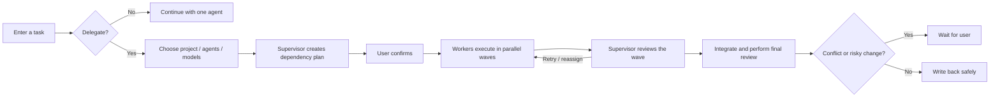

<div align="center">
  

# Open Pet Office

### Bring your AI agent team to the Windows desktop

One supervisor pet receives your work and summons up to four workers when needed.<br>
Follow live Codex tasks, mix models, run in isolated workspaces, and review every delivery.

[简体中文](README.md) · [English](README_EN.md)

[](https://github.com/Gu-kai-lei/Open-Pet-Office/releases/latest)
[](https://github.com/Gu-kai-lei/Open-Pet-Office/releases)
[](https://github.com/Gu-kai-lei/Open-Pet-Office/actions/workflows/ci.yml)
[](#download-and-quick-start)
[](LICENSE)

**[Download for Windows](https://github.com/Gu-kai-lei/Open-Pet-Office/releases/latest)** · [Quick start](docs/GETTING_STARTED_EN.md) · [Report an issue](https://github.com/Gu-kai-lei/Open-Pet-Office/issues/new/choose)
</div>


> [!IMPORTANT]
> Open Pet Office is an early Windows preview. It already handles real projects, while its UI, protocols, and data model continue to evolve.

## Why Open Pet Office?

<table>
  <tr>
    <td width="33%" valign="top">
      <h3>🐾 Collaboration you can see</h3>
      <p>The supervisor stays on your desktop. Workers appear only when a task needs them, with clear thinking, working, waiting, failure, and completion states.</p>
    </td>
    <td width="33%" valign="top">
      <h3>🧠 A real supervisor loop</h3>
      <p>The supervisor plans dependencies, dispatches work in waves, reviews each stage, retries or reassigns failures, and performs the final review.</p>
    </td>
    <td width="33%" valign="top">
      <h3>🔒 Project-safe execution</h3>
      <p>Every worker runs in an isolated worktree or snapshot. Conflicts, deletions, and out-of-scope writes pause instead of overwriting your files.</p>
    </td>
  </tr>
</table>

## Download and quick start

1. Download `Pet-Office-*-portable.exe` from the [latest Release](https://github.com/Gu-kai-lei/Open-Pet-Office/releases/latest).
2. Install and sign in to Codex CLI 0.155 or newer.
3. Run the app, hover over the supervisor pet, and click the compose icon.
4. Send a simple task directly, or enable Delegation for a project, agents, and models.

The public build is currently unsigned, so Windows SmartScreen may show an unknown-publisher warning. The Release page includes a SHA-256 digest for verification.

Want third-party models? The optional [OpenCodex](https://github.com/lidge-jun/opencodex) layer can route DeepSeek, GLM, and other providers into Codex. See the [getting started guide](docs/GETTING_STARTED_EN.md) for details.

## From one prompt to a reviewed delivery



With Delegation off, the pet is a lightweight entry point to a persistent Codex conversation. With Delegation on, the same composer becomes a recoverable Mission workflow.

## What you get

| Capability | Experience |
| --- | --- |
| **Live Codex tasks** | Read-only monitoring of local Codex sessions, including work started directly in Codex Desktop |
| **1 + 4 agent team** | One supervisor and up to four workers, each with its own model |
| **Persistent Missions** | Dependency graph, execution waves, structured reports, stage reviews, reassignment, and restart recovery |
| **Isolated workspaces** | Git worktrees for clean repositories; snapshots for dirty Git and non-Git projects |
| **Projects and sessions** | Create, continue, or reset context; rename, archive, restore, filter, and clean attachments |
| **Approvals and questions** | Handle command approvals, agent questions, conflicts, and recovery from one activity center |
| **File drop** | Drop files onto a pet to copy them into the project `inbox/` and attach relative paths |
| **Models and quota** | Codex five-hour and weekly limits, plus provider balances when APIs are available |
| **Petdex appearances** | Multiple animated pets, with a direct route to discover more on Petdex |
| **Desktop reliability** | Multiple displays, fullscreen avoidance, tray controls, shortcuts, notification levels, and reduced motion |

## Live status without interruption

The supervisor's live card shows the active model, task summary, current stage, and latest safe progress. With several tasks running, it shows the most recently updated task and the remaining count. Click it to return to the matching Codex task.

The bell activity center brings together:

- **Needs attention:** approvals, answers, conflicts, and recovery decisions
- **In progress:** Codex Desktop work, single-agent chats, and Missions
- **Recently finished:** accurate completion, interruption, failure, and cancellation states

Desktop updates are redacted and truncated. Full command output, system prompts, tokens, and secrets never belong in a pet bubble.

## Multi-model collaboration

Open Pet Office uses Codex as the conversation and execution surface, with OpenCodex as an optional router for compatible providers. Every pet can select a different model. The supervisor can use code, vision, long-context, speed, and cost tags to recommend participants, while you retain final control over agents and models.

| Model source | Connection | Quota display |
| --- | --- | --- |
| OpenAI / Codex | Codex sign-in | Account-level five-hour and weekly remaining percentage |
| DeepSeek, GLM, and others | OpenCodex provider | Balance when the provider exposes a compatible API |
| Other Codex-visible models | Custom OpenCodex config | Added to the model catalog and selectable per agent |

## How Missions protect your project

Mission plans and review records live under `.pet-office/` in the project. Runtime copies and complete logs live under `~/.pet-office/runtime/`. Workers write only to their own isolated environments; accepted work enters an integration workspace before the supervisor prepares write-back.

These conditions pause for user action:

- The main project changes while a Mission is running
- Several workers create a conflicting edit to the same file
- A task deletes files, writes outside its plan, or changes many binaries
- A node repeatedly fails, dependencies cannot proceed, or the app exits unexpectedly

Read [Architecture](docs/ARCHITECTURE_EN.md) for the module map, lifecycle, storage, and safety boundaries.

## Documentation

| Document | Contents |
| --- | --- |
| [Getting started](docs/GETTING_STARTED_EN.md) | Installation, first chat, Missions, file drop, and troubleshooting |
| [Architecture](docs/ARCHITECTURE_EN.md) | Modules, Mission lifecycle, isolation, local data, and safety boundaries |
| [Roadmap](docs/ROADMAP_EN.md) | Completed versions and next-stage direction |
| [Changelog](CHANGELOG.md) | Release additions and fixes |
| [Contributing](CONTRIBUTING.md) | Local development, tests, and pull request expectations |
| [Security](SECURITY.md) | Private vulnerability reporting |

## Run from source

```powershell
git clone https://github.com/Gu-kai-lei/Open-Pet-Office.git
cd Open-Pet-Office
npm install
npm test
npm start
```

Build the Windows portable executable with `npm run dist`.

Tests cover session aggregation, partial and rotated JSONL, lifecycle states, redaction, activity-panel races, file ingestion, conversation recovery, Mission dependency and isolation behavior, and v0.12 / v0.13 product contracts.

## Privacy and safety

- Session monitoring is strictly read-only.
- API keys, authorization headers, tokens, and passwords are redacted from desktop and crash summaries.
- Single-agent work keeps Codex sandbox and approval semantics.
- Mission workers can write only inside their isolated environments.
- Crash reports remain local and no telemetry is uploaded automatically.
- File drop copies the source; it never moves or deletes it.

Report security issues privately through [GitHub Security Advisories](https://github.com/Gu-kai-lei/Open-Pet-Office/security/advisories/new).

<details>
<summary><strong>Current limitations</strong></summary>

- Windows 10/11 is the current supported platform.
- Single-agent conversations use Codex App Server; Mission workers currently execute through parallel Codex CLI processes.
- Session Monitor depends on the local Codex JSONL format.
- `codex://threads/<id>` is still an experimental deep link.
- Petdex appearances are discovered in-app but not downloaded in-app yet.
- The current public portable build has no Windows code-signing certificate.

</details>

## Contributing

Bug reports, interaction problems, and concrete new use cases are welcome. Read [CONTRIBUTING.md](CONTRIBUTING.md) before opening a pull request, and remove API keys, access tokens, and private conversation content from screenshots or logs.

- [Report a bug](https://github.com/Gu-kai-lei/Open-Pet-Office/issues/new?template=bug_report.yml)
- [Request a feature](https://github.com/Gu-kai-lei/Open-Pet-Office/issues/new?template=feature_request.yml)
- [View the roadmap](docs/ROADMAP_EN.md)

## Acknowledgements and trademarks

The interaction design draws inspiration from Codex pets, Munder Difflin, and multi-agent orchestration tools. OpenCodex is the optional model-routing layer, and Petdex is the optional appearance ecosystem.

Open Pet Office is a community project with no official affiliation with OpenAI, Petdex, model providers, or third-party pet artists. Codex, DeepSeek, and other names belong to their respective owners.

## License

[MIT](LICENSE) © Gu-kai-lei
