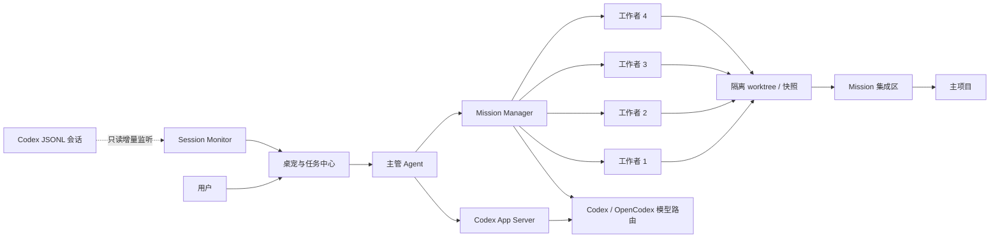

# 架构说明

Open Pet Office 是 Codex Desktop 与多模型 Agent 的本地可视化协作层。Electron 主进程负责窗口、任务注册、会话监听和模型调度；渲染层只负责桌宠和交互展示。



## 核心模块

| 模块 | 责任 |
| --- | --- |
| `src/main.js` | Electron 生命周期、IPC、窗口、托盘、快捷键、通知与统一任务注册 |
| `src/appserver.js` | 单 Agent 持久会话、流式回复、审批与用户提问 |
| `src/session-monitor.js` | 只读增量聚合 Codex Desktop JSONL，恢复和更新实时任务 |
| `src/mission-manager.js` | Mission 状态机、依赖波次、阶段复核、重派、恢复与最终结论 |
| `src/mission-workspace.js` | Git worktree、脏工作区快照、非 Git 副本、集成与冲突检测 |
| `src/dispatcher.js` | 工作者进程并发、进度解析、取消和资源清理 |
| `src/inbox.js` | 安全复制拖入文件、限制路径与文件大小、生成相对路径 |
| `renderer/` | 桌宠、输入框、任务中心、项目、模型、形象和设置 UI |

## Mission 生命周期

```text
planning → awaiting_confirmation → running → reviewing
                                      │          │
                                      ├─ retry / reassign
                                      ├─ needs_input
                                      └─ completed / partially_succeeded / failed / cancelled
```

每个 Mission 持久化到项目的 `.pet-office/missions/<missionId>/`。运行期 worktree、快照、进程信息和完整日志存放在 `~/.pet-office/runtime/<missionId>/`，不会写进项目提交历史。

## 隔离策略

| 项目状态 | 工作者环境 |
| --- | --- |
| 干净 Git 项目 | 每个写入任务拥有独立 worktree 和分支 |
| 存在未提交改动的 Git 项目 | 从用户当前可见状态创建隔离快照副本 |
| 非 Git 项目 | 为每个写入任务创建独立项目副本 |

已接受结果先进入 Mission 集成区。回写主项目之前会重新校验基线；文件冲突、删除、计划外路径或主项目漂移都会暂停并请求用户处理。

## 本地数据

```text
~/.pet-office/
├── state.json            # 应用设置、项目和会话索引
├── logs/                 # 轮换应用日志
├── crashes/              # 本地脱敏崩溃记录
├── runtime/              # Mission 运行环境
└── bridge/               # 可选的文件桥接目录

<project>/.pet-office/
├── MEMORY.md
└── missions/<missionId>/ # 计划、事件、结构化消息与复核记录
```

## 安全边界

- Session Monitor 只读会话日志，不修改、移动或归档 Codex 文件。
- API Key、Authorization、token 和密码在任务摘要与崩溃记录中脱敏。
- 单 Agent 使用 Codex `workspace-write + on-request` 审批模型。
- Mission 工作者只能写自己的隔离环境；主项目回写由主管和用户确认规则约束。
- 崩溃记录仅保存在本机，当前版本不会自动上传遥测。
