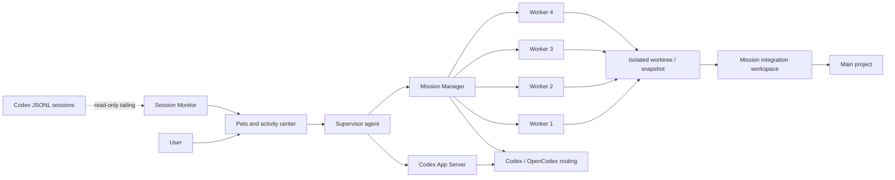

# Architecture

Open Pet Office is a local visual collaboration layer for Codex Desktop and multi-model agents. The Electron main process owns windows, task registration, session monitoring, and model execution. The renderer owns pet presentation and user interaction.



## Core modules

| Module | Responsibility |
| --- | --- |
| `src/main.js` | Electron lifecycle, IPC, window, tray, shortcuts, notifications, and unified task registry |
| `src/appserver.js` | Persistent single-agent conversations, streaming, approvals, and user questions |
| `src/session-monitor.js` | Read-only incremental aggregation of Codex Desktop JSONL tasks |
| `src/mission-manager.js` | Mission state machine, dependency waves, stage review, reassignment, recovery, and final conclusion |
| `src/mission-workspace.js` | Git worktrees, dirty-workspace snapshots, non-Git copies, integration, and conflict detection |
| `src/dispatcher.js` | Worker concurrency, progress parsing, cancellation, and cleanup |
| `src/inbox.js` | Safe file copying, path and size limits, and project-relative attachment paths |
| `renderer/` | Pets, composer, activity center, projects, models, appearances, and settings |

## Mission lifecycle

```text
planning → awaiting_confirmation → running → reviewing
                                      │          │
                                      ├─ retry / reassign
                                      ├─ needs_input
                                      └─ completed / partially_succeeded / failed / cancelled
```

Project-visible Mission metadata lives under `.pet-office/missions/<missionId>/`. Runtime worktrees, snapshots, process state, and complete logs live under `~/.pet-office/runtime/<missionId>/`.

## Isolation strategy

| Project state | Worker environment |
| --- | --- |
| Clean Git repository | One worktree and branch per write task |
| Dirty Git repository | Isolated snapshot of the user-visible state |
| Non-Git project | Independent project copy per write task |

Accepted changes enter the Mission integration workspace first. Before write-back, the supervisor verifies the main-project baseline. Conflicts, deletions, out-of-scope paths, and project drift pause for user action.

## Security boundaries

- Session Monitor never edits, moves, or archives Codex sessions.
- API keys, authorization headers, tokens, and passwords are redacted from summaries and crash reports.
- Single-agent work uses Codex `workspace-write + on-request` semantics.
- Mission workers can write only to their isolated environments.
- Crash reports remain local and are not uploaded automatically.
